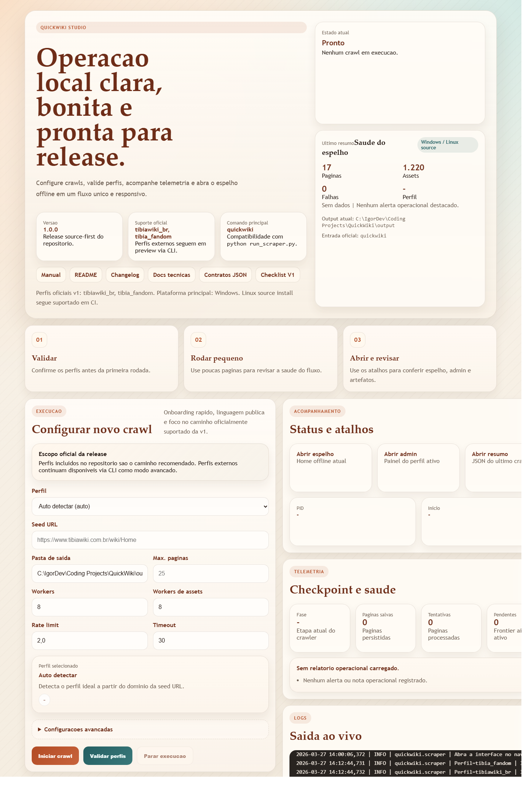
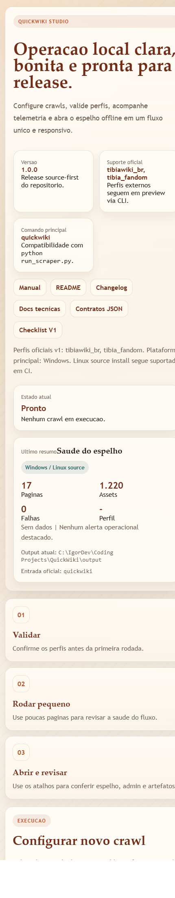

# QuickWiki

QuickWiki e um espelhador offline multi-wiki pensado para preservar conteudo util, operar localmente e transformar crawls em artefatos navegaveis, auditaveis e bonitos o suficiente para portfolio.



## O que o projeto entrega

- crawl offline com foco em MediaWiki e Fandom
- perfis declarativos versionados por wiki
- GUI local para iniciar, acompanhar e validar execucoes
- artefatos HTML e JSON prontos para navegacao, auditoria e troubleshooting
- contratos de artefatos e schema de perfis documentados
- instalacao source-first com suporte a `quickwiki`, `python -m quickwiki` e `python run_scraper.py`

## Destaques de portfolio

- arquitetura separada entre CLI, crawler, storage, GUI e contratos publicos
- trilha de release com CI, build de distribuicao, smoke tests e checklist
- documentacao operacional, tecnica e de governanca no proprio repositorio
- interface local `QuickWiki Studio` com foco em observabilidade de runtime

## Capturas da interface



## Instalacao

```bash
git clone <repo-url>
cd QuickWiki
python -m pip install .
```

Entrypoints suportados:

- principal: `quickwiki`
- modulo: `python -m quickwiki`
- compatibilidade em checkout local: `python run_scraper.py`

Se `quickwiki` nao for reconhecido no Windows apos a instalacao, use `python -m quickwiki` ou ajuste o `PATH` da pasta `Scripts` do Python do usuario.

Os perfis built-in oficiais tambem funcionam a partir do pacote instalado fora da raiz do repositorio. Use `QUICKWIKI_ROOT`, `--profiles-dir` ou `--site-profile-file` quando quiser apontar para uma clone especifica, perfis externos ou caminhos customizados.

## Quickstart

```bash
python -m quickwiki --validate-site-profiles
python -m quickwiki --list-site-profiles
python -m quickwiki --site-profile tibiawiki_br --max-pages 25
python -m quickwiki --serve-only --output-dir output
```

Para abrir a GUI local:

```bash
python -m quickwiki --gui
```

## Artefatos gerados

Uma execucao tipica produz:

- `output/index.html`
- `output/admin/index.html`
- `output/data/indexes/summary.json`
- `output/data/indexes/run_report.json`
- `output/checkpoints/runtime_status.json`
- `output/data/indexes/pages_manifest.json`
- `output/data/indexes/failed_pages.json`
- `output/logs/scraper.log`

## Validacao atual

Validado localmente em 2026-03-28:

- `python -m unittest discover -s tests -v`
- `python -m build`
- `python -m twine check dist/*`
- `python -m pip install .`
- `python -m quickwiki --version`
- `python -m quickwiki --list-site-profiles`
- `python -m quickwiki --validate-site-profiles`
- smoke crawl curto com perfil built-in
- smoke de modulo instalado fora da raiz do repositorio

## Documentacao

- [docs/README.md](docs/README.md)
- [docs/STATUS.md](docs/STATUS.md)
- [docs/RELEASE_CHECKLIST.md](docs/RELEASE_CHECKLIST.md)
- [docs/PROFILE_SCHEMA.md](docs/PROFILE_SCHEMA.md)
- [docs/ARTIFACT_CONTRACTS.md](docs/ARTIFACT_CONTRACTS.md)
- [Manual do Usuario/README.md](Manual%20do%20Usu%C3%A1rio/README.md)
- [DOCUMENTACAO_TECNICA.md](DOCUMENTACAO_TECNICA.md)
- [CHANGELOG.md](CHANGELOG.md)
- [CONTRIBUTING.md](CONTRIBUTING.md)
- [SECURITY.md](SECURITY.md)
- [SUPPORT.md](SUPPORT.md)
- [CODE_OF_CONDUCT.md](CODE_OF_CONDUCT.md)

## Suporte de v1

- perfis built-in do projeto sao o escopo oficialmente suportado
- perfis externos continuam disponiveis via CLI como modo avancado/preview
- a GUI prioriza o fluxo guiado para os perfis built-in

## Licenca

QuickWiki e distribuido sob a licenca [MIT](LICENSE). O projeto pode ser estudado, reutilizado e evoluido pela comunidade, mantendo os creditos e o aviso de licenca.
